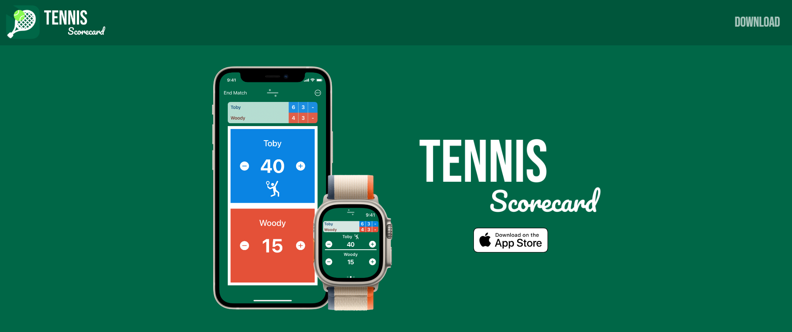

# Tennis Scorecard App Landing Page

## Introduction



Welcome to the Tennis Scorecard app landing page! This page is here to advertise the Tennis Scorecard app for iOS, watchOS, iPadOS, macOS, & visionOS devices.

### Built With

- HTML
- SASS
- Node.js

## Getting Started

To visit the site on the web click [here](https://tennisscorecard.app/).

To install the project locally on your machine, complete the following steps:

### Prerequisites

If you have do not have Node.js and npm package manager installed, visit the following links to download and install.

- [Node.js](https://nodejs.org)
- [npm](https://docs.npmjs.com/cli/v8/commands/npm-install)

### Installation

Start by opening your terminal inside the folder you'd like to house the repository and run the following commands in the terminal:

- Clone the repo to your machine

```sh
git clone git@github.com:michaelfalco/Tennis-Scorecard-Website.git
```

- Install all NPM packages

```sh
npm install
```

## Usage

This page was built to inform users about the Tennis Scorecard app and its features. Links on the page routes users to the Apple App Store where they can download the Tennis Scorecard app to most Apple devices.

## License

Distributed under the MIT License. See `LICENSE.txt` for more information.

## Contact

Tennis Scorecard Developer <br>
Micheal Falco - connectwithmichael@i-cloud.com - https://github.com/michaelfalco

Landing Page Developer <br>
Dan Gray - daniel.w.gray1994@gmail.com - https://github.com/DanielG808
