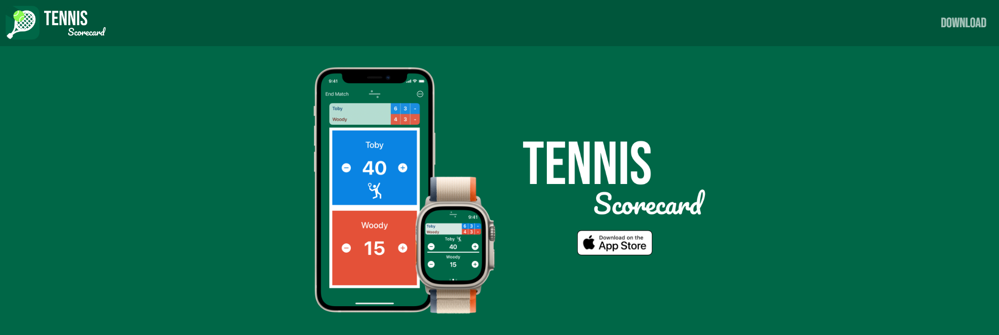

# Tennis Scorecard App Landing Page

## Introduction



Welcome to the Tennis and Pickleball Scorecard app landing page! This page is here to advertise the Tennis Scorecard and Pickleball Scorecard apps for iOS, watchOS, iPadOS, macOS, & visionOS devices.

### Built With

- HTML
- SASS
- Node.js

## Getting Started

To visit the Tennis Scorecard site on the web click [here](https://tennisscorecard.app/).

To visit the Pickleball Scorecard site on the web click [here](https://tennisscorecard.app/pickleball).

To install the project locally on your machine, complete the following steps:

### Prerequisites

If you do not have Node.js and npm package manager installed, visit the following links to download and install.

- [Node.js](https://nodejs.org)
- [npm](https://docs.npmjs.com/cli/v8/commands/npm-install)

### Installation

Start by opening your terminal inside the folder you'd like to house the repository and run the following commands in the terminal:

- Clone the repo to your machine

```sh
git clone git@github.com:michaelfalco/Tennis-Scorecard-Website.git
```

- Install all NPM packages

```sh
npm install
```

## Usage

This page was built to inform users about the Tennis Scorecard app and its features. Links on the page routes users to the Apple App Store where they can download the Tennis Scorecard app to most Apple devices.

## Contribute

To contribute to the project, changes can be made in the `/public` folder. After all changes have been added run the following command in the terminal:

- Re-Build CSS styles for the app

##### Tennis Scorecard:

```sh
npm run build:style
```

##### Pickleball Scorecard:

```sh
npm run build:style-pickleball
```

Once the script is complete, commit the changes to your branch and submit a pull request for review.

## License

Distributed under the MIT License. See `LICENSE.txt` for more information.

## Contact

Tennis Scorecard Developer <br>
Michael Falco - connectwithmichael@icloud.com - https://github.com/michaelfalco

Landing Page Developer <br>
Dan Gray - daniel.w.gray1994@gmail.com - https://github.com/DanielG808

Project Link: https://github.com/michaelfalco/Tennis-Scorecard-Website
